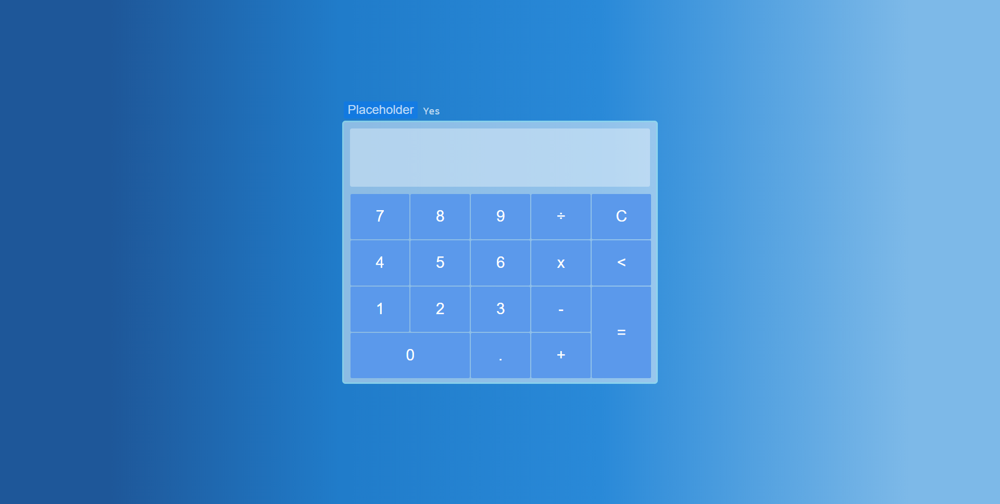

# Calculator-in-JS-CSS-HTML 
This is a simple calculator built in HTML, CSS & JavaScript. 
#### Preview:

### Refs:
* Line gradient to background made in [ColorZilla.](https://www.colorzilla.com/gradient-editor/)
* Division sign taken from [tools.oratory.](https://tools.oratory.com/altcodes.html)
